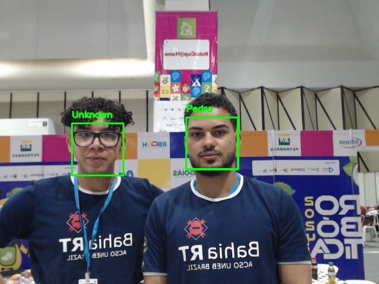

# BahiaRT_atHome
This folder contains the BahiaRT team contribution in the object detection challenge.

# How to run?
Install the dependencies as indicated below;  


Clone this repository;  

After cloning the repository, you can install the necessary Python dependencies using the requirementsPersonal.txt file:  


```bash
pip install -r requirementsPersonal.txt
```

In the workspace:
```bash
colcon build
source install/setup.bash
cd src/personal_recognition/personal_recognition/
```

After that, run the nodes individually, in this order:

```bash
image_capture_node
```
```bash
personal_recognition_node
```
```bash
turn_around_node
```
```bash
voice_node
```
Follow the program instructions. If you have any questions, contact us.

# Example of Detection Results

